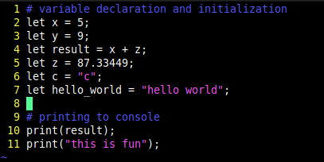
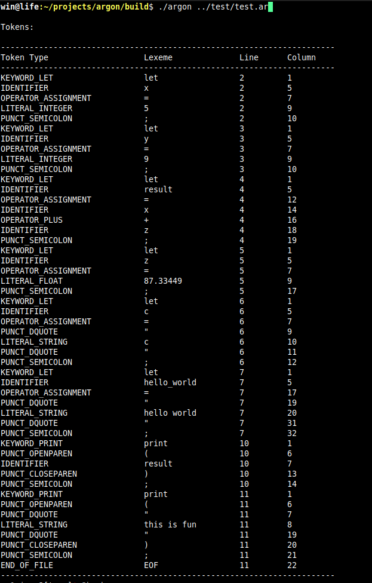

# Argon
A simple, programming language inspired by Python and C syntax, with a minimal compiler built from scratch in C++ and an LLVM-based backend for code generation.

## Progress
Currently working on the **lexical analyzer (lexer)**.

- **Ingest source code**: Completed
- **Token definitions**: Completed
- **Lexer**: In progress
- **Parser**: Planned
- **AST + Semantic analysis**: Planned
- **LLVM IR generation**: Planned
- **Code emission and linking**: Planned
- **Implement standard functions and library**: Planned

### Lexer Progress

Following is the test code used.


Below is a sample of the lexer’s output, showing each token’s type, lexeme (actual value), and its position in the source (line and column).


## Dependencies
- Written in **C++20**
- Built with **CMake**
- Currently uses only the **C++ Standard Library (STL)**
- Planned: **LLVM backend** for code generation

## Example Syntax
*Note*: Syntax may change as my mind wishes.

```argon
# variable declaration and initialization
let x = 12;
let y = 99.999;
let c = "c";
let s = "hello world";

# printing to console
print(x);
```

## License
MIT License — see `LICENSE` file.
